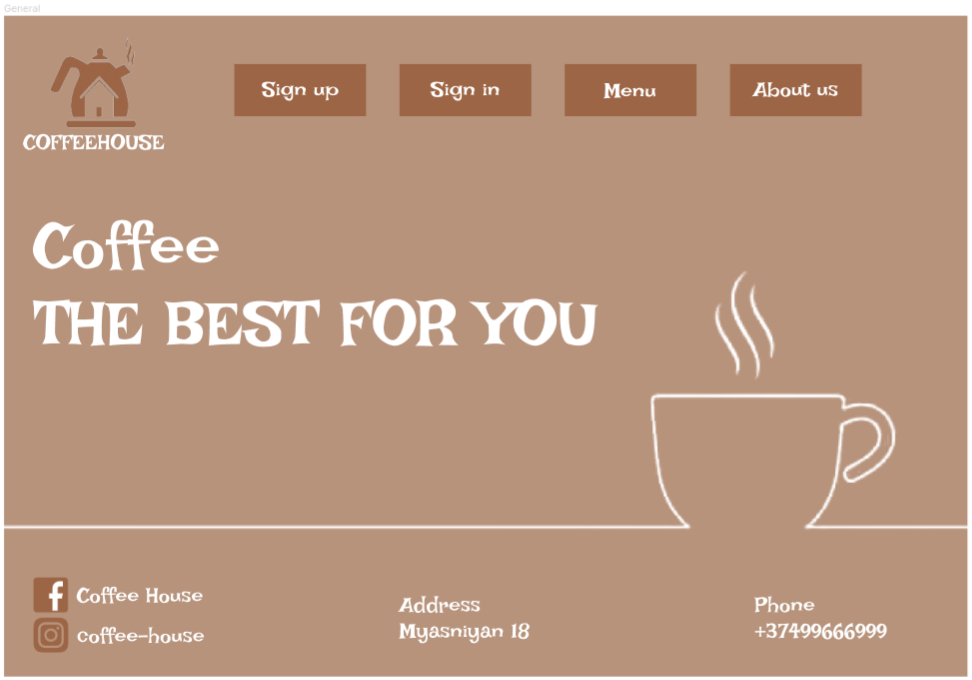
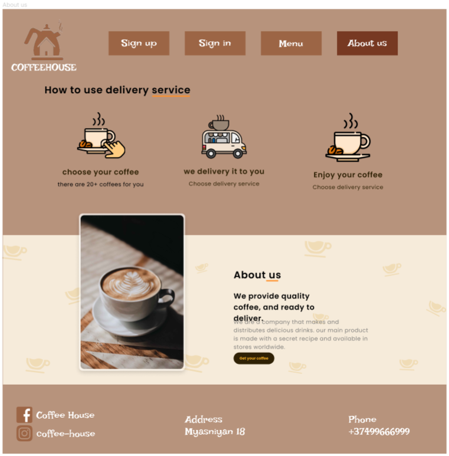
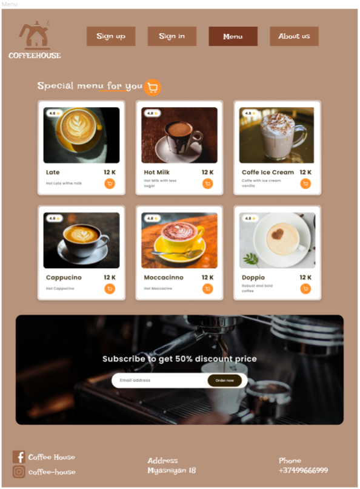
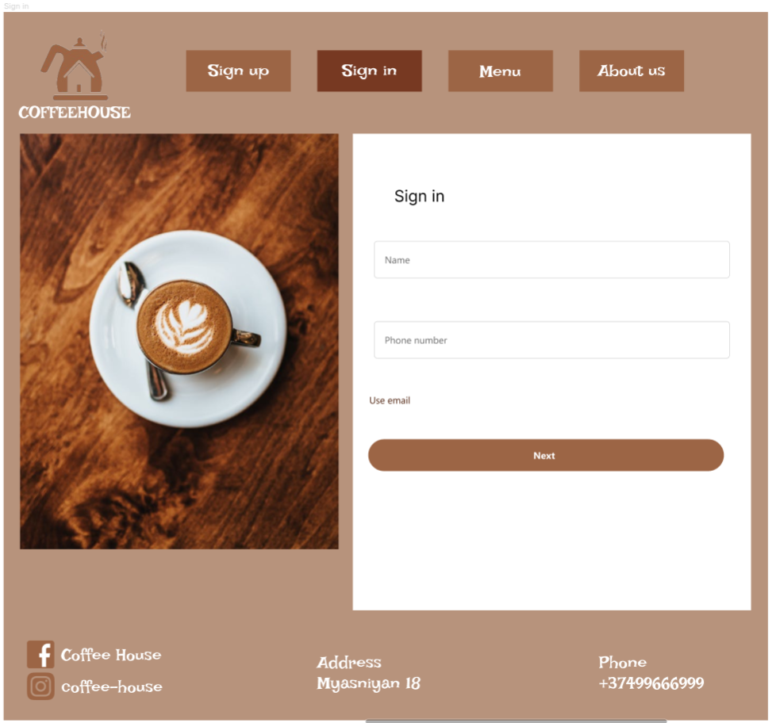
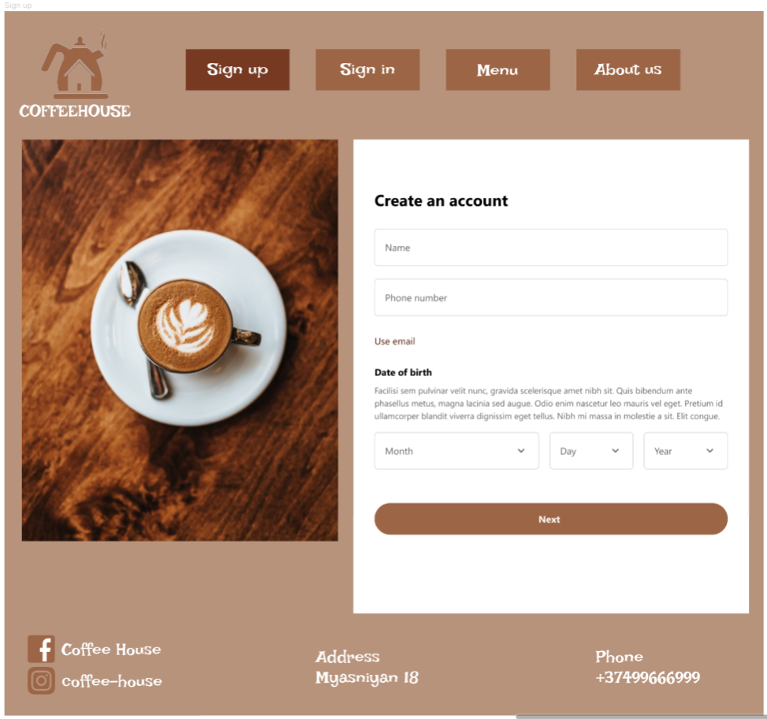

# Coffee House

## Directory stracture 

## Installation 

```
git clone https://github.com/htc4/HaykQ.git
```

## Usage 

Open HaykQ directory -> index.html file

## Description

When you open index.html file, the following page opens. 
You can go to "Menu", "AboutUs", "SignIn", "SignUp" pages.

It's a general page in website. 


You can know information about us, and contact with us.


In menu page you can buy your favourite coffee.


You can enter to your coffee application.


You can register.


## Demo version
https://www.figma.com/file/4HKXC8HGMSTs4PuVJgAfje/Untitled?type=design&node-id=265%3A239&mode=design&t=d0rVLKrcPBSG6nEC-1